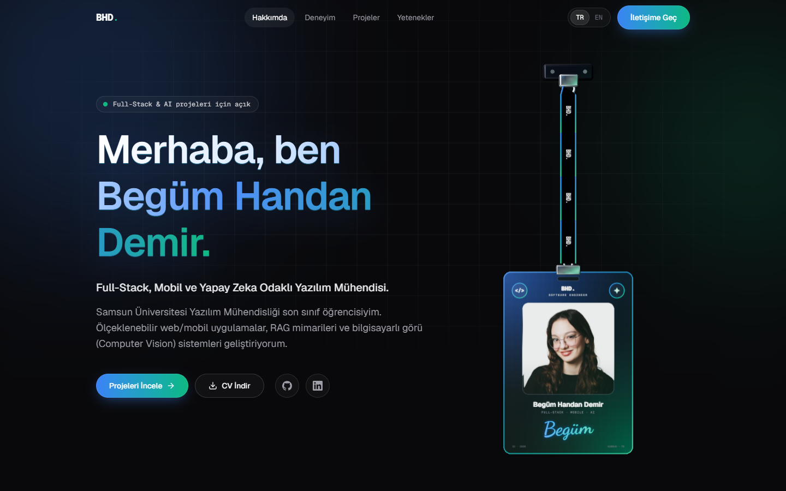

<div align="center">

# BHD. — Kişisel Portfolyo

**Begüm Handan Demir** · Full-Stack, Mobil ve Yapay Zeka Odaklı Yazılım Mühendisi

Linear ve Vercel estetiğinden ilham alan; karanlık mod odaklı, animasyonlu ve
iki dilli (TR/EN) kişisel portfolyo sitesi.




</div>

---

## ✨ Öne Çıkanlar

- **3D asılı ID kartı (lanyard)**: React Three Fiber + Rapier fizik motoruyla gerçek zamanlı
  simüle edilen ip ve kart. Mouse ile tutup sürüklenebilir; bırakınca sarkaç gibi sallanıp
  yavaşça durur. Sayfa açılışında kart yukarıdan düşerek yerine oturur.
- **Performans odaklı 3D**: Three.js/Rapier yalnızca masaüstünde (≥ 1024px) ve dinamik olarak
  yüklenir; Hero ekrandan çıkınca render ve fizik tamamen durur. Mobil, tablet ve
  "hareketi azalt" tercihli kullanıcılar hafif bir HTML/CSS kart görür.
- **3D tipografi**: Fare hareketine tepki veren perspektif/tilt efekti ve beyaz → mavi → yeşil
  gradient başlık.
- **İki dil (TR/EN)**: Harici kütüphane olmadan React Context + tipli çeviri objesi.
  Varsayılan dil Türkçe; seçim tarayıcıda hatırlanır.
- **Filtrelenebilir bento grid**: Framer Motion layout animasyonlarıyla kategoriye göre
  (AI & ML, Mobil, Full-Stack) proje filtreleme.
- **Mikro etkileşimler**: İmleci takip eden spotlight kartlar, scroll ile tetiklenen giriş
  animasyonları, aktif bölümü takip eden navbar.
- **Tam çalışan iletişim formu**: Alan bazlı doğrulama, erişilebilir hata mesajları, toast
  bildirimi ve "E-postamı Kopyala" butonu.
- **Erişilebilirlik**: Klavye ile gezinme, görünür focus durumları, "İçeriğe geç" linki,
  ARIA etiketleri ve `prefers-reduced-motion` desteği.
- **SEO**: Metadata, Open Graph / Twitter kartları ve otomatik üretilen OG görseli.

## 🧱 Teknolojiler

| Alan | Kullanılanlar |
| --- | --- |
| Framework | Next.js 15 (App Router), React 19, TypeScript |
| Stil | Tailwind CSS v4, Geist Sans & Geist Mono |
| Animasyon | Framer Motion |
| 3D & Fizik | Three.js, @react-three/fiber, @react-three/drei, @react-three/rapier, meshline |
| İkonlar | Lucide React |

## 🚀 Kurulum

Gereksinim: **Node.js 18.18+** (önerilen: 20 veya üzeri)

```bash
git clone https://github.com/begumhandan/My_Portfolio_Web.git
cd My_Portfolio_Web
npm install
npm run dev
```

Site **http://localhost:3000** adresinde açılır.

| Komut | Açıklama |
| --- | --- |
| `npm run dev` | Geliştirme sunucusu |
| `npm run build` | Production derlemesi |
| `npm start` | Production sunucusu (`build` sonrası) |

> İmza fontu (Dancing Script) `next/font/google` ile yüklendiği için ilk derlemede internet
> bağlantısı gerekir.

## 📁 Proje Yapısı

```
├── app/
│   ├── layout.tsx            # Fontlar, SEO metadata, provider'lar
│   ├── page.tsx              # Bölümlerin sıralandığı ana sayfa
│   ├── globals.css           # Tailwind teması, animasyonlar, yardımcı sınıflar
│   └── opengraph-image.tsx   # Otomatik üretilen paylaşım görseli
├── components/
│   ├── Navbar.tsx  Hero.tsx  Experience.tsx  Projects.tsx
│   ├── Skills.tsx  Contact.tsx  Footer.tsx
│   ├── lanyard/              # 3D ID kartı: sahne, fizik, texture üretimi, mobil sürüm
│   └── ui/                   # SpotlightCard, Reveal, SectionHeading, Toast, ...
├── data/                     # ✏️ Tüm site içeriği burada
│   ├── site.ts               # İsim, e-posta, sosyal linkler, CV ve fotoğraf yolu
│   ├── experience.ts         # Deneyim & başarılar (timeline)
│   ├── projects.ts           # Projeler ve filtre kategorileri
│   └── skills.ts             # Teknik yetkinlikler
├── lib/
│   ├── i18n/                 # Dil context'i ve TR/EN çevirileri
│   └── fonts.ts
└── public/
    ├── cv/                   # İndirilebilir CV
    └── images/               # Profil fotoğrafı
```

## ✏️ İçerik Güncelleme

İçerik component'lerden ayrıdır; **kod değiştirmeden** yalnızca `data/` altındaki dosyalar
düzenlenerek güncellenebilir.

- **Yeni proje eklemek:** `data/projects.ts` içindeki diziye yeni bir obje ekleyin. Grid ve
  filtre sayıları otomatik güncellenir. `featured: true` kartı tam genişliğe yayar,
  `badge` özel bir vurgu rozeti ekler, `github` / `demo` alanları boş bırakılırsa ilgili
  linkler gizlenir.
- **Yeni deneyim eklemek:** `data/experience.ts` dizisine kronolojik sırada ekleyin
  (`kind`: `work` · `achievement` · `research`).
- **Çok dilli alanlar:** `{ tr: "...", en: "..." }` biçiminde yazılır; teknoloji adları gibi
  dile bağlı olmayan değerler düz metin olabilir.
- **Arayüz metinleri:** `lib/i18n/translations.ts`. İngilizce sözlük Türkçe ile aynı yapıda
  olmak zorundadır; eksik bir çeviri TypeScript hatası verir.
- **CV / fotoğraf:** `public/cv/Begum-Handan-Demir-CV.pdf` ve `public/images/begum.jpg`
  dosyalarını aynı adla değiştirmeniz yeterlidir.

## 🌐 Yayınlama

Proje [Vercel](https://vercel.com/) üzerinde ek ayar gerektirmeden yayınlanabilir:
repoyu Vercel'e import edin, framework olarak Next.js otomatik algılanır. Yayından sonra
`data/site.ts` içindeki `url` alanını kendi alan adınızla güncelleyin (SEO ve Open Graph
linkleri bu adresi kullanır).

## 📬 İletişim

- **E-posta:** begumhandandemir@gmail.com
- **GitHub:** [@begumhandan](https://github.com/begumhandan)

---

<div align="center">
<sub>© Begüm Handan Demir</sub>
</div>
